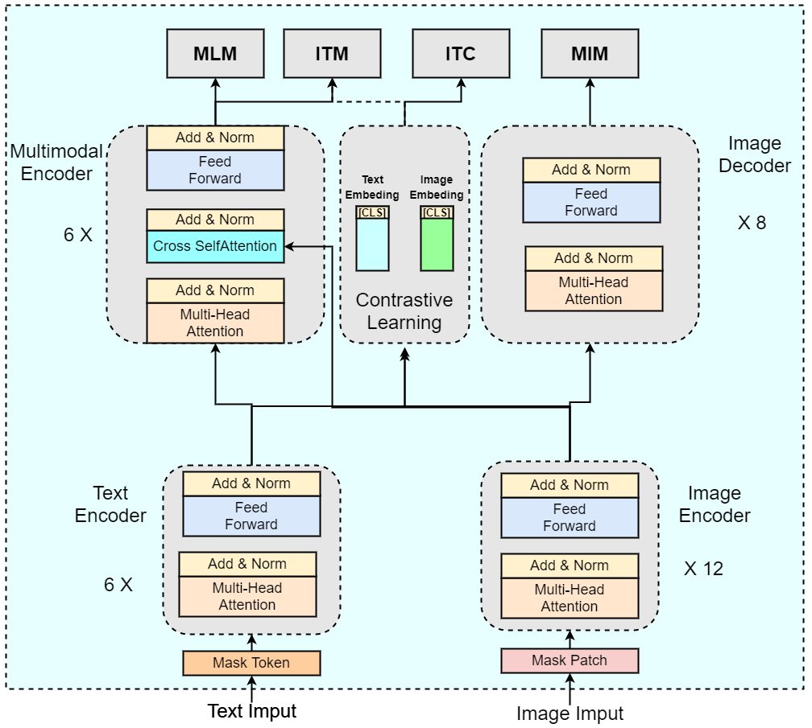
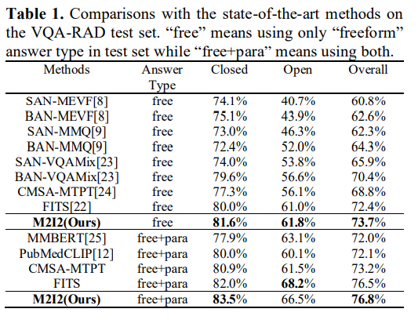
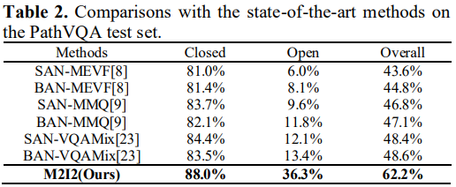
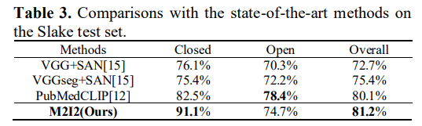

# M2I2
## [Self-supervised vision-language pretraining for Medical visual question answering](https://arxiv.org/abs/2211.13594)

This is the official implementation of `M2I2` for the visual question answering task in medical domain at [ISBI-2023](https://2023.biomedicalimaging.org/en/default.asp).
Our proposal achieves superior accuracy in comparison with other state-of-the-art (sota) methods on three public medical VQA datasets: [VQA-RAD dataset](https://www.nature.com/articles/sdata2018251#data-citations), [PathVQA dataset](https://arxiv.org/abs/2003.10286) and [Slake dataset](https://arxiv.org/abs/2102.09542). Paper link [here](https://arxiv.org/abs/2211.13594).

This repository is based on and inspired by @Junnan Li's [work](https://github.com/salesforce/ALBEF). We sincerely thank for their sharing of the codes.

<div align=center>

</div>
<center>Figure 1: Overview of the proposed medical VQA model. </center>


## Requirements
Run the following command to install the required packages:
```bash
pip install -r requirements.txt
```

## Training and Testing
### 1. Dataset Preparation
Please organize the datasets as the following structure:
```angular2
+--clef2022
| +--train
| | +--ImageCLEFmedCaption_2022_train_000001.jpg
| | +--ImageCLEFmedCaption_2022_train_000002.jpg
| | +--...
| +--valid
| | +--ImageCLEFmedCaption_2022_valid_084258.jpg
| | +--ImageCLEFmedCaption_2022_valid_084259.jpg
| | +--...
| +--clef22022_train.json
| +--clef22022_valid.json

+--data_RAD
| +--images
| | +--synpic100132.jpg
| | +--synpic100176.jpg
| | +--...
| +--trainset.json
| +--testset.json
| +--answer_list.json

+--data_PathVQA
| +--images
| | +--train
| | | +--train_0000.jpg
| | | +--train_0001.jpg
| | | +--...
| | +--val
| | | +--val_0000.jpg
| | | +--val_0001.jpg
| | | +--...
| | +--test
| | | +--test_0000.jpg
| | | +--test_0001.jpg
| | | +--...
| +--pathvqa_test.json
| +--pathvqa_train.json
| +--pathvqa_val.json
| +--answer_trainval_list.json

+--data_Slake
| +--imgs
| | +--xmlab0
| | | +--source.jpg.jpg
| | | +--question.json
| | | +--...
| | +--....
| +--slake_test.json
| +--slake_train.json
| +--slake_val.json
| +--answer_list.json
```
### 2. Pre-training
```angular2
python3 pretrain_med.py  --output_dir ./pretrain
```

### 3. Finetune on Medical VQA tasks
```angular2
python3 train_rad.py --checkpoint ./pretrain/med_pretrain_29.pth  --output_dir ./output/rad
python3 train_pathvqa.py --checkpoint ./pretrain/med_pretrain_29.pth  --output_dir ./output/pathvqa
python3 train_slake.py --checkpoint ./pretrain/med_pretrain_29.pth  --output_dir ./output/slake
```

### 4. Evaluate on Medical VQA tasks
```angular2
python3 vqaRadEval.py --quesFile ./data_Rad/testset.json --resFile ./output/rad/result/med_pretrain_29_vqa_result_<epoch>.json
python3 vqaPathEval.py --quesFile ./data_PathVQA/pathvqa_test.json --resFile ./output/pathvqa/result/med_pretrain_29_vqa_result_<epoch>.json
python3 vqaSlakeEval.py --quesFile ./data_Slake/slake_test.json --resFile ./output/slake/result/med_pretrain_29_vqa_result_<epoch>.json
```
## Comparison with the sota
### VQA-Rad dataset


### PathVQA dataset


### Slake dataset


## Citation:
```
@article{M2I2,
  title     = {Self-supervised vision-language pretraining for Medical visual question answering},
  author    = {Pengfei Li, Gang Liu, Lin Tan, Jinying Liao and Shenjun Zhong},
  journal   = {arXiv preprint arXiv.2211.13594},
  year      = {2022}
}
```

## License
MIT License